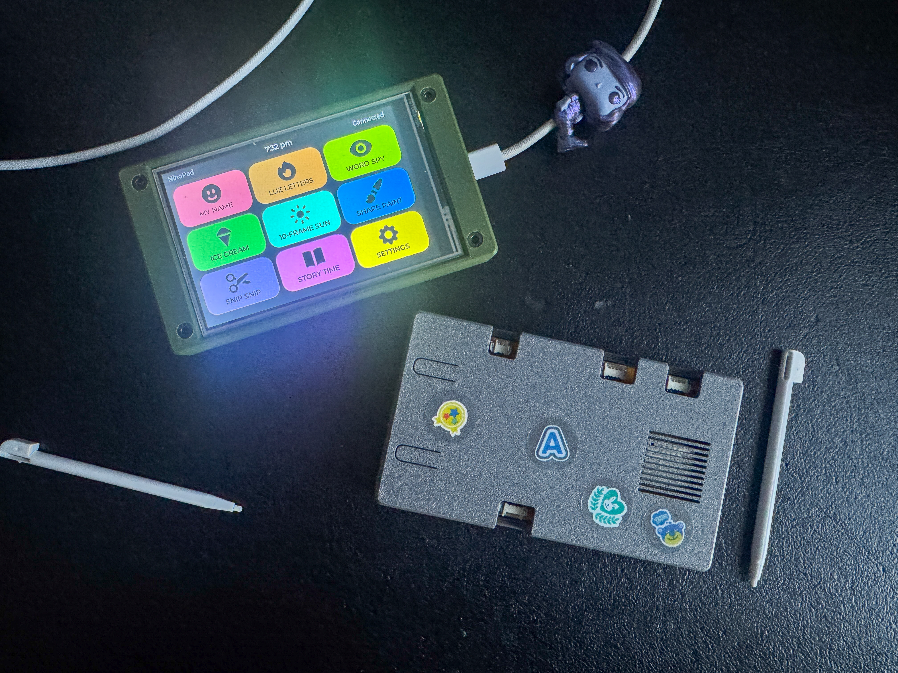

# Building NinoPad — A Touchscreen Learning Device for My Kindergartener

My son starts kindergarten this fall. The school sent home a packet of summer
worksheets — tracing letters, counting, word recognition, all the prep work to
get him ready. He does a page or two and then he's done. I don't blame him.
Worksheets are boring.

I built him an alarm clock last month,
[Astrobot](https://github.com/pipozoft/astrobot), and seeing him actually use
something I made got me thinking about what else I could build. I mentioned it to
my friend [Mario The Maker](https://mariothemaker.com/), asking about the Adafruit
MagTag — I was thinking of something simple, just a word-a-day thing to help my
son start reading. He pointed me to the ESP32 CYD (Cheap Yellow Display) 4.0" dev
board instead and shared his
[EnvMonitor project](https://github.com/MarioCruz/ESP32-EnvMonitor) that runs
MicroPython on it. I ordered a couple.

My hardware tinkering was stuck in the Arduino UNO/YÚN era. The ESP32 world was
new to me. But I'm a UI engineer by trade — I've been pushing the limits of
whatever platform I'm working on since the Borland C++ days, through the web era,
and now into hardware. And these specs are *tight*. No PSRAM. 320KB total RAM.
4MB flash. That's the kind of constraint that forces you back to your roots,
squeezing every byte because you have no choice. It's frustrating and incredibly
fun.

So I tried running LVGL on this little CYD board and hit a wall immediately.
These boards are cheap but documentation is *terrible*. Even with LLMs helping,
I went in circles for days. But that made every win sweeter. Every app that
compiled, every animation that didn't crash, every boot screen that showed up
correctly — each one felt like breaking through.

This is not an iPad Pro. That's the whole point. I wanted something limited,
something that couldn't do YouTube or in-app purchases or flashy distractions.
Just targeted learning and nothing else. A device that's *mine* — I control
every pixel, every app, every byte of flash. There's nothing on here that
doesn't belong.

So I built **NinoPad**: a touchscreen learning device on an ESP32 with a 4-inch
display and nine educational apps.

## The Hardware

| Part | What |
|---|---|
| MCU | ESP32 (ESP-WROOM-32, 240MHz, 320KB RAM, 4MB flash) |
| Display | 4" ST7796 480×320 TFT, RGB565 color |
| Touch | XPT2046 resistive (or FT6236 capacitive) |
| Storage | MicroSD card for images |
| Case | [ESP32 CYD 4.0" Enclosure](https://www.etsy.com/listing/4501970079/esp32-cyd-40-enclosure-esp32-32e-cheap) |

Total BOM is about $20-25 depending on where you source things. The ESP32
DevKit was $5, the display was $12, the rest was pennies.

The hardest constraint: **no PSRAM**. The ESP32-WROOM-32 has only 320KB of total
RAM. The display itself (480×320 × 2 bytes per pixel) is 307KB for a single
frame — you can't even hold one full screen in memory. LVGL runs in *partial
buffer mode*, rendering 160 rows at a time (~153KB), flushing to the display
twice per frame. When that malloc fails on boot, it falls back to 60 rows and
6 flushes.

Everything — the LVGL heap, the display buffer, the static allocations — has to
fit inside 320KB. There's nowhere else to go.

## The SPI Bus Hack

The display and touch sensor share the same SPI bus. Instead of adding a second
bus for touch, the driver *steals* the SPI pins from the ESP32's GPIO matrix:

1. Detach SPI3 signals from their GPIO matrix routes
2. Bit-bang the XPT2046 protocol via direct register writes
3. Re-attach SPI3 signals back

This happens 60 times per second, every frame. It's hacky and it works
beautifully.

## The Nine Apps

Nine apps in a 3×3 grid, each with its own color and icon:

| App | Color | What It Does |
|---|---|---|
| **My Name** | Red | Traces or draws the child's name on a canvas. 8-color palette. |
| **Luz Letters** | Orange | Full-screen letter tracing in a giant dotted font. A-Z, a-z, 0-9. |
| **Word Spy** | Lime | Picture-based word recognition. 110 word pairs, 3 difficulty levels. |
| **Ice Cream Sort** | Green | Addition and subtraction quiz with ice cream themed buttons. |
| **10-Frame Suns** | Aqua | Counting up to 20 using friendly sun faces in a ten-frame grid. |
| **Shape Paint** | Blue | "Paint all the TRIANGLES RED" — color-by-shape/scavenger hunt. |
| **Snip Snip** | Purple | Path tracing for fine motor skills. Straight, zigzag, wave, spiral. |
| **Story Time** | Pink | Fill-in-the-blank reading comprehension. 50+ sentences, 3 levels. |
| **Settings** | Yellow | Parent gate (age verification), child name entry. |

Each app is an independent LVGL widget tree inside a shared content area.
The screen reuse pattern (`lv_obj_clean()` instead of `lv_scr_load()`) means
there's never more than one screen object alive — critical when every byte
counts.

## The Flash Budget War

I didn't expect flash to be the bottleneck, but it was. LVGL's default config
enables every widget: meters, tables, charts, calendars, arcs, bars, tileviews.
I disabled everything unused, reclaimed about 30KB, and still hit the wall at
98% usage (1,310,720 bytes).

Every app had to earn its space. Procedural drawing code was ripped out and
replaced with OpenMoji images loaded from SD card. The icon rendering pipeline
switched from PNG files to a compiled icon font. Unused font sizes were pruned.

The current build sits at **94% flash** and **27% RAM**. The remaining ~78KB of
flash is my last frontier.

## Images Without PSRAM

The Word Spy and Story Time apps show pictures. Each OpenMoji emoji is a 128×96
RGB565A8 binary image (~36KB) stored on the SD card. When a round starts, the
app reads the file from SD and displays it via `lv_image`. No caching, no
preloading — just a ~50ms SD read per image.

The pipeline is a Python script that downloads OpenMoji PNGs from GitHub,
center-fits them to 128×96, converts to LVGL's native RGB565A8 format, and
writes `.bin` files. 119 images, all transparent-backed, all readable from SD.

## The Ice Cream Pivot

The counting game was originally designed as a jar-filling exercise. But the
buttons — two scoops in brown and cream — looked exactly like an ice cream cone.
So I renamed it "Ice Cream Sort," swapped the mechanic to addition and
subtraction, and kept the scoop buttons. The end screen says "Perfect! All
correct!" with a star rating. My kids call it "the ice cream game."

## What I Learned

**SPI pin stealing works.** The GPIO matrix on ESP32 is flexible enough to
detach and reattach signals at runtime without glitching the display.

**Partial buffer rendering is a minefield.** LVGL v9 removed the rounder
callback that aligned dirty rectangles to buffer boundaries. Without it, text
updates cause visual tearing. The workaround is `lv_obj_invalidate(lv_scr_act())`
after every text change — a full-screen redraw that fixes it.

**Timer cleanup is not optional.** If you clean a screen while a timer
references objects on it, the callback becomes a dangling pointer. The device
freezes. Every screen transition must stop its timers first.

**You can't delete widgets from their own event handlers.** LVGL doesn't expect
the widget firing the event to be destroyed during dispatch. `lv_async_call()`
defers the deletion until the event cycle finishes.

**Flash is the new RAM.** On a constrained MCU, flash space became the resource
I fought over most. Every string, every font glyph, every compiled-in image,
every enabled LVGL feature costs bytes I couldn't spare.

## The Source

Full project on GitHub:
**[https://github.com/pipozoft/ninopad](https://github.com/pipozoft/ninopad)**

MIT licensed. PlatformIO build system.
Flash with `.venv/bin/pio run -e esp32 -t upload`.

---

*July 2026. Built for my kids, because a worksheet just isn't the same.*
